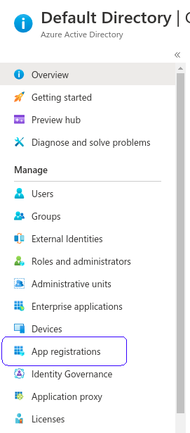

# Novos dados necessários do Luis para Colmeia


passos:
- [Criar uma aplicação no Active Directory](#criando-uma-aplicação)
- [Garantir role de subscriptions para aplicação](#garantir-role-de-subscriptions-para-aplicação)
- [Preencher dados na aplicação da Colmeia](#preencher-dados-na-aplicação-da-colmeia)


## Criando uma aplicação
> Para que seja possível vincular uma subscrição de pagamentos da Azure a uma base de conhecimento do Luis precisamos criar uma aplicação no "Azure Active Directory", para expor uma API que tenha acesso as subscrições e aplicações do Luis. Para isso vá para:
```
https://portal.azure.com/
```
> Na parte superior da tela procure pelo ícone "Azul Active Directory" ou use a barra de pesquisa para busca-lo


> No menu esquerdo procure por "App Registrations"




> Na parte superior da página selecione "new registration"


> Insira um nome para a aplicação e assegure-se de que a opção "Default directory only - Single tenant" esteja selecionada


> Após a criação da aplicação você será redirecionado para uma tela de "overview" da mesma, copie os seguintes dados:
> 
> 
>- Application (client) ID
>- Directory (tenant) ID 


> Na mesma tela, olhe para o menu esquerdo e selecione "Certificates & Secrets"


> Na seção Client secrets clique em "new client secret"


> Insira um nome e selecione "never" como expiração


> Após a confirmação, ele estará disponível na tabela, copie seu valor


## Garantir role de subscriptions para aplicação

> Precisamos conceber autorização de alterar subscriptions a aplicação, para isso vá para
```
https://portal.azure.com/
```
> Na parte superior da tela procure pelo ícone "Subscriptions" ou use a barra de pesquisa para busca-lo


> Haverá uma lista de subscrições, selecione a desejada (provavelmente se chama paga por uso)


> No menu esquerdo selecione "Access Control IAM"


> Na parte superior da pagina selecione a tab "Role assignments"


> Na parte superior da pagina selecione "add"


> No menu aberto selecione "add role assignment"


> No canto direito irá abrir um diálogo, selecione "Contributor" como a role, e em "select" digite o nome da aplicação criada e selecione ela.


